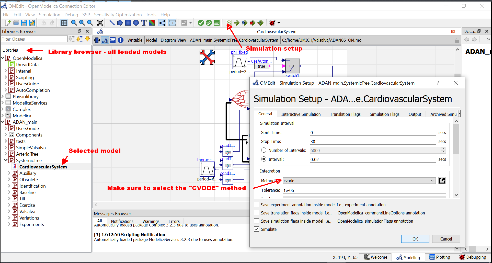
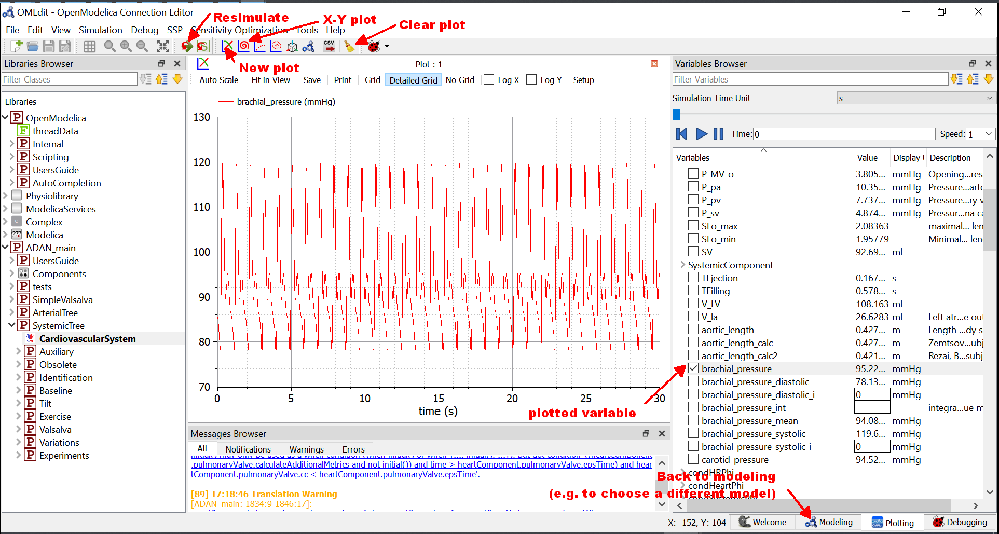

# How to run the model in OpenModelica

The OpenModelica environment is a a free open-source Modelica tool. Although it lacks some features of professional tools and their speed (the model simulates in about a half or a third time in some commercial tools) it is generally usable for both simulation and development.

## Installation prerequisites
Follow the prerequisites in https://github.com/filip-jezek/Valsalva/blob/master/README.md

## Loading the model
IMPORTANT!! The modelica source file formatting is overwritten just by loading into OpenModelica without prompt. Might cause some troubles when opened in two editors at once.

- Load the Physiolibrary 2.4
  - File - load - Physiolibrary/Physiolibrary/Package.mo
- Open the ADAN86.mo model
  - File - open - Valsalva/ADAN86.mo

## running the baseline simulation

- navigate to ADAN_main.SystemicTree.CardiovascularSystem and doubleclick to open. This is a base class, all changes applied here are inherited in other models.
- Select Simulation - Simulation Setup from the menu. Set simulation time (here 30s) and some reasonable interval (e.g. 0.02s). Make sure the CVODE solver is selected, as the simulation might be unstable with other solvers. Click OK. The OM editor might hang for a while, please be patient.
- Select variables to plot in right panel "Variables Browser"
- To draw X-Y plot (e.g. PV loop) select the New parametric plot button and click on the variable for X axis (e.g. V_LV and then on the variable intended for Y axis (e.g. P_LV)
- To adjust a parameter, find it in Variables browser and modify it. Click the Re-simulate button. The simulation will rerun with updated parameter value. Note, tha this change is not saved in the model.
- To return to the modeling mode, select the Modeling tab in bottom right part

{:width="100px"}

{:width="100px"}

## Running advanced use cases

- To simulate e.g. Valsalva maneuver, in *Libraries browser* navigate to ADAN_main.SystemicTree.Valsalva.CVS_Valsalva and doubleclick to open. This class inherits all from the CardiovascularSystem and adds just a setting to enable increase in airway pressure. Simulate for 60s and plot e.g. brachial pressure and HR (heart rate)
- SImilarly, one might run following use cases:
  - 60° HUT Tilt: ADAN_main.SystemicTree.Tilt.CVS_tiltable
  - 90% of maximal exercise: ADAN_main.SystemicTree.Exercise.CVS_exercise
  - Step-up exercise: ADAN_main.SystemicTree.Exercise.CVS_Exercise_stepping
  - Arterial stiffening (acute): ADAN_main.SystemicTree.Variations.Impairments.Normal.imp_arSt and after baroreflex compensation: ADAN_main.SystemicTree.Variations.Impairments.Normal.imp_arSt_ss
  - Arterial stiffening (acute): ADAN_main.SystemicTree.Variations.Impairments.Normal.imp_avRe and after baroreflex compensation: ADAN_main.SystemicTree.Variations.Impairments.Normal.imp_avRe
  - Effect of impairments on step-up exercise: All in ADAN_main.SystemicTree.Variations.Impairments.ExStepping

## Exploring the model
- Switch to the Text view and explore the code.
  - Everything is explorable through the text, no external dependencies are loaded
  - add equations and adjust parameters in the text view. Note, that all parameters here are in their base unit (i.e. SI unit)!
- Switch to the diagram view to add new components or reparametrize them
  - e.g. to simulate hemorrhage, add Physiolibrary.Hydraulic.Sources.UnlimitedOutflowPump, connect it to the pulmonary connector and double click to parametrize the outflow.
  - double-click useAutonomousPhi and set y to *false* to prevent baroreflex control

## Using Modelica
Explore additional resources about Modelica and how to use it.
 - video
 - tiller university
 - fritzson..?

